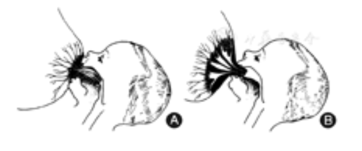
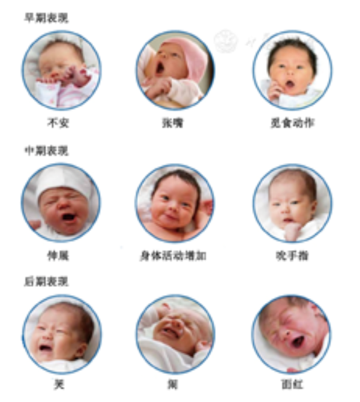
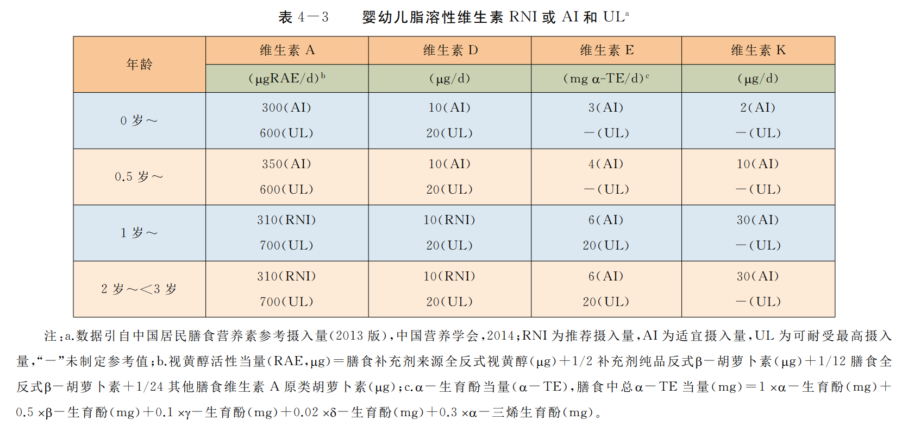
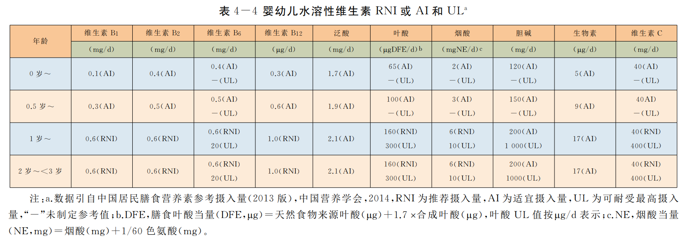
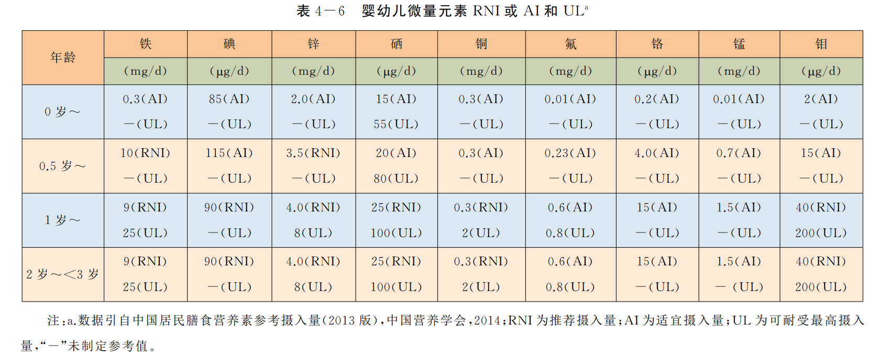
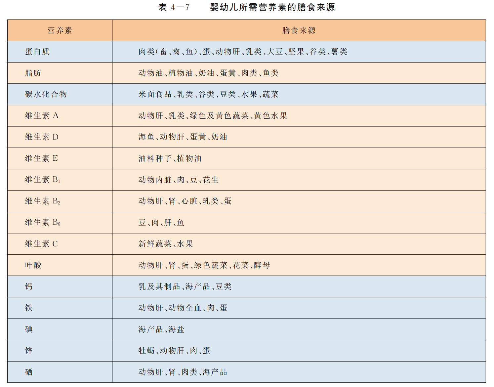

# 宝宝居家成长指南

## 一、 用品

:table:(height=80vh,width=100%,fixedHeader=true)
| **名称**        | **必须** | **数量** | **常用品牌或规格** | **备注**                                               |
| ----------------- | -------- | -------- | ------------------------------------------------------ | ------------------------------------------------------ |
| 衣服 | ✅       | n        | **全棉时代，BabyCare，英氏** | 根据季节和天气购买，婴幼儿时期发育较快，根据实际情况自行判断 |
| 婴儿睡袋 | ❔ | 1 | **全棉时代，BabyCare，英氏** |  |
| 围嘴 | ✅ | 4 |  | 拍嗝使用，也可以用口水巾 |
| 口水巾 | ❔ | 4 | | 和围嘴大部分功能一致 |
|  |  |  |  |  |
| 纸尿裤 | ✅ | n | **Moony，好奇，花王，** |  |
| 隔尿垫 | ✅ | n |  |  |
| 棉柔巾 | ✅ | n | **全棉时代** |  |
| 护脐贴/护脐带 | ❌ | n |  | 建议用75%酒精或者碘伏消毒 |
|  |  |  |  |  |
| 防摔床围/防摔蚊帐 | ✅ | 1 |  |                                                              |
| 婴儿床/床中床 | ✅ | 1 |  |                                                        |
| 定型枕 | ❌        | 1 | | 用处不大 |
| 折叠洗澡盆 | ✅ | 1 |  | |
| 尿布台 | ✅ | 1 | **雅亲** | 有空余书桌的可以不用 |
| 爬爬垫 | ✅ | 1 |  |  |
| 安全座椅/安全提篮 | ✅ | 1 |  | 提篮的使用时间很短，建议直接购买安全座椅 |
| 婴儿推车 | ✅ | 1 |  |  |
| 餐椅 | ✅ | 1 |  |  |
| 摇摇椅 | ❔ | 1 |  |  |
|  |  |  |  | |
| 240ml奶瓶 | ✅ | 1-2 | **hegen，贝亲，布朗博士，世喜** | ppsu材质，注意奶嘴开孔和流速；可以准备两个分开喝水和喝奶 |
| 奶嘴 | ✅ | n | **贝亲** |  |
| 恒温水壶 | ✅ | 1 |  |                                                              |
| 消毒柜/奶瓶消毒器 | ❔ | 1 | **小白熊** | 见下方 用品说明 |
| 奶瓶架 | ❔ | 1 |  | 没有消毒器的话，需要一个用来晾干奶瓶奶嘴 |
| 温奶器 | ❔ | 1 | **小白熊** | 有恒温水壶可以不用；如果是 **冻母乳瓶喂会需要** |
| 摇奶器 | ❔ | 1 | **小白熊** | 单人带娃时会需要，用处不是特别大 |
|  |  |  |  |  |
| 婴儿理发器 | ✅ | 1 | **BabyCare，易简** | 最好是带吸碎发功能的，避免掉落到宝宝身上引起瘙痒 |
| 婴儿指甲剪 | ✅ | 1 | **贝亲** | 一周后需要勤剪指甲 |
| 磨甲器 | ❔ | 1 | **ZoLi** | 宝爸宝妈剪的好的话，也可以不用，不然新剪的指甲比较锋利 |
| 安抚奶嘴 | ❔ | 2 | **新安怡** | 有利有弊，自行选择 |
|  |  |  |  |  |
| 独立洗衣机 | ❔ | 1 | | |
| 独立小冰箱/立式冰柜 | ❔ | 1 | | |
| 家用摄像头 | ❔ | 1-2 | | 带语音通话 |

### 1.1 部分用品说明

#### （1）关于紫外线消毒柜

紫外线：阳光中波长100~400纳米的光线，分为 UVA (315-400nm)、UVB (280-315nm)、UVC (200-280nm)、UVD(100-200nm)，真正具有杀菌作用的是 **UVC紫外线**。

其杀菌原理是通过紫外线的照射，破坏及改变微生物的DNA（脱氧核糖核酸）或RNA（核糖核酸）的分子结构，造成生长性细胞死亡和（或）再生细胞死亡，达到杀菌消毒的效果。

一些说法是：**紫外线会加速塑料材质老化**，且 **旧紫外线灯珠含有汞成分，会产生臭氧加速硅胶老化**。而 PPSU 奶瓶属于塑料大类，奶嘴通常也是食品级硅胶材质，所以建议直接使用 **开水煮 3~5 分钟消毒后自然晾干，或者蒸汽消毒**。

现在的一些紫外线消毒柜采用的是 **UVC 灯珠，不含汞成分，波段也属于较安全波段，对硅胶和塑料的影响较小**，所以可以用来给奶瓶奶嘴消毒。

但是，**影响较小并不等于没有影响**，即使是 UVC 紫外线仍然会加速塑料和硅胶老化分解；并且，UVC 波段紫外线能量最高，由于大气层存在没有天然 UVC 紫外线直接照射到人体，所以人体没有什么感觉，而 UVC 灯珠的消毒柜，即便使用，也应该选购 **密闭性好并且在开门时能自动关闭灯珠的产品**。

> 参考资料：[UVA/UVB/UVC/UVD哪个紫外线波段最有危害？-上海路阳生物技术有限公司](https://www.luyoruv.com/new4/392.html)，[维基百科](https://zh.wikipedia.org/zh-cn/%E7%B4%AB%E5%A4%96%E7%BA%BF#%E5%B0%8D%E4%BA%BA%E9%A1%9E%E5%81%A5%E5%BA%B7%E7%9A%84%E6%95%88%E6%87%89)

## 二、喂养

### 2.1 奶粉和营养补剂

| **名称**        | **必须** | **常用品牌** | **用量** | **备注**                                               |
| ----------------- | -------- | ------------------------------------------------------ | ------------------------------------------------------ | ----------------- |
| 奶粉 |  |  |  |  |
| 维生素 D | ✅ | **星鲨，Ddrops** | 常规400IU | 出生15天后服用；母乳喂养宝宝通常需要补；其他情况遵医嘱 |
| 维生素K | ✅ | - |  | 出生后6 h以内，建议肌肉注射1.0 mg维生素K，以防止维生素K缺乏性出血症 |
| 益生菌 | ❔ | **科汉森，拉曼，Culturelle** | - | 健康宝宝一般不用，主要用于辅助治疗病毒感染引起的水样腹泻或者使用抗生素后的肠道菌群平衡 |
| 钙 | ❔ | - | 200mg (0~6M)，250mg (7-12M)，600mg (1~3Y) | 保证奶量，合理补钙；奶才是宝宝钙的主要来源；辅食补充即可 |
| 铁 | ❔ | - | - | 4月以上宝宝才需要注意补铁；辅食补充即可 |
| 锌 | ❔ | - | - | 国内宝宝基本上都不需要单独注意补锌，保证正常饮食即可 |
| DHA/鱼肝油 | ❔ | **挪威小鱼，Bioisland** | - | 保证充足母乳一般就能满足需求； |

### 2.2 小于 6 月龄

#### 2.2.1 喂养建议

**1．纯母乳喂养：**

产后尽早开奶，母乳是婴儿出生后最佳的食物来源。纯母乳喂养指除了必需的药物、维生素和矿物质补充剂外，母乳是婴儿唯一的食物来源，不进食任何其他的液体和固体食物，包括水。母乳含有88%的水，正确、充分的母乳喂养可以充分保证6月龄以内婴儿对水的需求，甚至在炎热的天气下只要母乳喂哺充分也无需额外补充水。

**2．配方奶喂养：**

母乳是婴儿最好的营养来源，但当母亲由于各种原因无法给婴儿喂母乳时，可以采用配方奶喂哺。新生儿配方奶喂养也应按需喂养，逐渐增加，当摄入配方奶约20 g/(kg·d)或150 ml/(kg·d)时，可满足其能量需要。同时需注意同一婴儿摄入奶量每天可波动，不同个体也有一定差异。

**3．乳母营养：**

乳母（即宝妈）应坚持平衡膳食，每天能量摄入应比平时增加，增加的量存在较大个体差异，一般每天增加2 092 kJ(相当于500 kcal，1 kcal＝4.184 0 kJ)的能量(相当于增加一餐)可以保证其产生足够乳汁喂哺婴儿。母乳喂养期间母亲应继续孕期的维生素和矿物质补充。母乳量及其中的蛋白质、脂肪和乳糖浓度受母亲膳食影响不大，但微量营养素及脂肪酸水平等则明显受母亲膳食影响。膳食均衡的健康母亲每周食用1～2次深海鱼可以基本保证乳汁中二十二碳六烯酸(docosahexaenoic acid，DHA)水平，不需要服用额外补充剂。如果母亲有营养不良或为素食者，除补充多种维生素外，还需要额外补充DHA。为避免汞摄入过多，孕妇应避免摄入食肉的大型鱼类。素食的母亲还应补充维生素B12。婴儿可以通过乳汁感受到不同种食物的味道，因此母亲进食不同种类的食物有利于婴儿以后接受不同种类的固体食物。

#### 2.2.2 进食行为建议

**1．母乳喂养技巧：**

产后应尽早开始母乳喂养(<1 h)，新生儿的第一口食物应该是母乳。帮助母亲建立正确的哺乳姿势也是确保顺利母乳喂养的重要条件。每次哺乳前都应用肥皂清洁双手。喂哺姿势有斜抱式、卧式、抱球式。无论采用何种姿势，要让婴儿的头和身体呈一条直线，婴儿身体贴近母亲，头和颈部得到支撑，尽量贴近乳房，鼻子面向乳头。哺乳前，母亲可用干净手指帮助婴儿口张大含住乳头和乳晕，上嘴唇盖住的乳晕要少于下嘴唇，下唇应朝外突出、下颌接触乳房为正确的"乳房喂养" ([图1A])。仅含住母亲的乳头，即上嘴唇盖住的乳晕大于或等于下嘴唇，下嘴唇向前或向口内缩，下颌远离乳房，为含吸不良，为"乳头喂养" ([图1B])。"乳头喂养"的情况可造成乳头咬破、乳汁吸入不足，因含大量乳汁的乳腺导管在乳晕下未被吸入。在尚未建立良好的母乳喂养习惯前，应避免让婴儿接触到奶瓶、安抚奶嘴及其他辅助喂哺装置。

母乳喂养时婴儿含吸母亲乳房的示意图　A：含吸正确——乳房喂养；B：含吸不正确——乳头喂养

**2．哺乳次数：**

鼓励按需哺乳，对早期建立和维持良好的母乳喂养习惯尤为重要。按需哺乳即在婴儿正确含吸乳房情况下，不限制母乳喂养的频率和持续时间。**1～2月龄的婴儿日间<2 h哺乳一次，这一时期如睡眠时间>4 h，建议将婴儿唤醒喂哺，避免奶量摄入不足。**夜间哺乳间隔时间可延长，约3 h，或4～5 h。24 h母乳喂哺次数为8～10次。新生婴儿因尚不适应宫外生活，可有含乳头时间较长(喂哺>30 min/次)，或喂哺频率过多情况(1.0～1.5 h喂哺一次)，均属按需哺乳。一般2月龄后可逐渐规律哺乳，如生长不足需排除吸吮不当或疾病。母亲乳头皲裂通常也与不正确含吸姿势有关。一旦出现乳头皲裂，可在每次哺乳后挤出少许乳汁均匀地涂在乳头上。

**3．奶瓶喂养姿势：**

奶瓶喂养婴儿时，应用上臂很好地支撑婴儿使其感觉舒适、安全，头和身体呈一直线，喂哺时应握住奶瓶并与婴儿有很好的眼神交流。避免在没有支撑情况下，让婴儿自己含着奶瓶喝奶，易发生呛咳、耳部感染，且在婴儿萌牙后易出现龋齿。

**4．奶瓶清洁、配方奶冲配及存放：**

每次使用后需彻底清洗并消毒奶瓶、奶嘴，可用专用消毒设备或者沸水中煮沸5 min消毒。冲配奶粉前需清洁相关区域并彻底用肥皂洗净双手。保证冲配奶的饮用水卫生，应用煮沸后冷却的水。严格按照说明冲配配方奶，冲配时先加水再加奶粉，用罐内配套的量勺称量奶粉，避免过稀或过浓造成婴儿营养不良或肾脏损伤。喂哺前先滴几滴在手腕内侧，确保奶液温度适宜。剩余液体奶液可存放入冰箱，下次食用时需温热后与新冲配的奶液混合食用。室温条件下放置超过1 h，或已经温热过一次的配方奶都应弃用。

**5．识别婴儿饥饿及饱腹信号：**

及时应答是早期建立良好进食习惯的关键。新生儿饥饿时可以出现觅食反射、吸吮动作或双手舞动；婴儿会出现把手放入嘴里吸吮、鬼脸、烦躁，大声哭吵是饥饿的最后信号。婴儿饥饿不同阶段的表情及动作详见[图2]。抚养人应该注意观察婴儿饥饿的早期信号，避免其哭闹后再喂哺，这会增加喂哺的困难，尤其是母乳喂养的婴儿，哭吵会影响含吸母亲乳头。婴儿停止吸吮、张嘴、头转开等往往代表饱腹感，不要再强迫进食。

图2-婴儿饥饿不同阶段的表情及动作

#### 2.2.3 常见问题与处理

**1．溢奶：**

喂奶间歇或喂奶后宜将婴儿头靠在母亲**肩上竖直抱起**，**空心掌轻拍背部**，可帮助排出吞入的空气而预防溢奶。婴儿睡眠时 **宜右侧卧位**，可预防睡眠时溢奶而致窒息。必要时可减少摄入奶量20～30 ml。

若经指导后婴儿溢奶症状无改善或体重增长不良，应及时转诊做进一步诊断，排除器质性疾病。

**2．安抚奶嘴：**

**1月龄以内的新生儿不建议使用安抚奶嘴**，因可能会影响母乳喂养习惯的建立并导致过早断母乳。若之后使用安抚奶嘴，需避免奶嘴使用和入睡行为之间建立不良条件反射，夜间醒来后依赖奶嘴重新入睡，会影响婴儿良好睡眠习惯的养成，导致频繁夜醒。

不建议在安抚奶嘴上涂抹糖浆或蜂蜜等以安抚婴儿。

**3．边吃边睡：**

初生的婴儿睡眠时间占比高，且昼夜节律尚未很好建立，因此大多会有边吃边睡的习惯。但是大多数婴儿**3月龄始**已经建立较为固定的昼夜规律，无论是母乳喂养还是配方奶喂养都应**避免边睡边吃**，喂奶的过程应是亲子互动的机会。可以适当提前喂奶时间，在婴儿相对较为清醒状态下喂奶，待吃奶结束婴儿出现思睡信号(揉眼睛、打哈欠等)但尚未睡着情况下，将其放在床上培养其独立入睡习惯。另外，边睡边吸奶还易发生窒息，也不利于婴儿口腔保健。

**4．母亲用药或烟酒摄入：**

母亲在服用大多数药物时，并不影响其继续母乳喂养婴儿。母亲服用安非他明、麦角胺、化疗药物、他汀类药物、镇静药、抗癫痫药等，建议暂不母乳喂养，具体可详见各种药物说明书。母亲应禁烟，吸烟可增加婴儿呼吸道过敏以及婴儿猝死综合征发生的危险，同时也影响乳汁分泌，致婴儿体重增加不良。酒精可降低婴儿对吸吮引发的"射乳反射"的敏感性，使泌乳下降，也对婴儿的运动发育产生不良影响，故建议母亲不饮酒或含酒精的饮料。母亲摄入含咖啡因的饮品(如咖啡、茶及咖啡因类饮料)每天应限制在2杯以内。

**5．母亲外出或开始上班后的喂养：**

鼓励外出或上班后的母亲坚持母乳喂养，每天哺乳不少于3次，在外出或上班时挤出母乳，以保持母乳的分泌量。母乳喂养过程中如乳汁过多，可用吸奶器吸出存放至特备的"乳袋"中。挤出后的母乳，应妥善保存在冰箱或冰包中，不同温度下母乳存放时间可参考下表，食用前用温水加热至40 ℃左右即可喂哺，避免用微波炉加热奶([表1])。

| 存储条件       |                                  | 存放参考时间 |
| -------------- | -------------------------------- | ------------ |
| 室温保存 ≤ 25℃ |                                  | 4h           |
| 冷藏保存       |                                  |              |
|                | 15℃便携式冰盒内                  | 24h          |
|                | 冰箱4℃冷藏室经常开关门           | 24h          |
|                | 冰箱4℃冷藏室靠近冰箱后壁最低温处 | 48h          |
| 冷冻保存       |                                  |              |
|                | -15℃独立冷冻室                   | 3-4月        |
|                | -20℃深低温冷冻                   | 6-12月       |

表1-母乳存放时间和温度

**6．母亲不宜哺乳情况：**

(1)母亲进行化疗或放射治疗；(2)严重心脏、肾脏、肝脏疾病，高血压及糖尿病伴有重要器官功能损害者，严重精神病、反复发作癫痫；(3)患各型传染性肝炎的急性期、活动期肺结核、流行性传染病时，不宜哺乳。以配方奶代替喂哺，可定时用吸乳器吸出母乳以防回奶，待母亲病愈，传染期已过，可继续哺乳；(4)患乳房疱疹者不宜哺乳；(5)吸毒母亲未戒毒前不宜哺乳；(6)艾滋病或感染艾滋病病毒的母亲不宜哺乳。

### 2.3 6～8月龄

> [0～3岁婴幼儿喂养建议(基层医师版) - 中华医学会儿科学分会儿童保健学组](https://seleguide.yiigle.com/uploads/guide_html/0%EF%BD%9E3%E5%B2%81%E5%A9%B4%E5%B9%BC%E5%84%BF%E5%96%82%E5%85%BB%E5%BB%BA%E8%AE%AE(%E5%9F%BA%E5%B1%82%E5%8C%BB%E5%B8%88%E7%89%88).html)

### 2.4 9~11月龄

> [0～3岁婴幼儿喂养建议(基层医师版) - 中华医学会儿科学分会儿童保健学组](https://seleguide.yiigle.com/uploads/guide_html/0%EF%BD%9E3%E5%B2%81%E5%A9%B4%E5%B9%BC%E5%84%BF%E5%96%82%E5%85%BB%E5%BB%BA%E8%AE%AE(%E5%9F%BA%E5%B1%82%E5%8C%BB%E5%B8%88%E7%89%88).html)

### 2.5 12到36月龄

> [0～3岁婴幼儿喂养建议(基层医师版) - 中华医学会儿科学分会儿童保健学组](https://seleguide.yiigle.com/uploads/guide_html/0%EF%BD%9E3%E5%B2%81%E5%A9%B4%E5%B9%BC%E5%84%BF%E5%96%82%E5%85%BB%E5%BB%BA%E8%AE%AE(%E5%9F%BA%E5%B1%82%E5%8C%BB%E5%B8%88%E7%89%88).html)

## 三、微量元素食物来源

### 3.1 铁

宝宝六个月后，随着成长的加速，体内的的储存铁逐渐减少，对铁的需求会开始增加。

食物来源：**红肉；鱼类；动物肝脏；含铁米粉**

### 3.2 锌

从 4 ~ 6 月开始，这阶段宝宝的免疫力、智力、生长发育等都处于快速增长阶段，对锌的需求也大大增加。

食物来源：**贝壳类海产品；瘦肉；动物肝脏**

### 3.3 钙

食物来源：**豆类；小鱼小虾；坚果**

### 3.4 维生素 A

食物来源：**动物肝脏；蛋类；乳制品；深色蔬菜和水果（如南瓜、胡萝卜、西兰花、菠菜、芒果和橘子等）**

### 3.5 维生素 D

食物来源：**鱼肝和 鱼油；鸡蛋**

### 3.6 维生素 B1

食物来源：**奶类、蛋类、各种肉类食品，以及动物内脏、谷类、蔬菜和水果**

### 3.7 维生素 C

食物来源：**新鲜蔬菜和水果**

## 四、辅食

## 五、抱法

