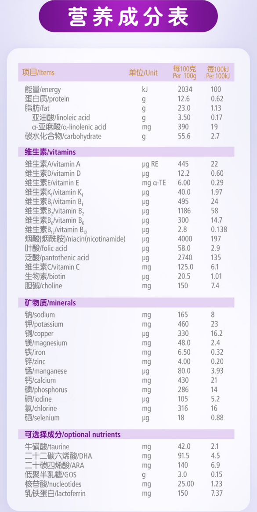
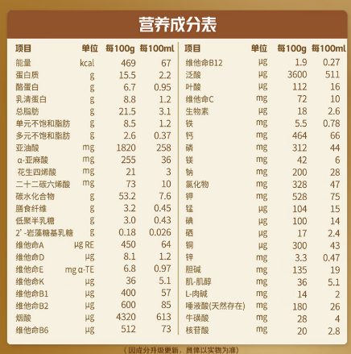

# 一、2021 国标

以下是按照乳基和豆基婴儿配方食品分类，提取每100kJ数据并整理的关键指标表格：

### 1. 乳基婴儿配方食品关键指标（每100kJ）

:table:(height=80vh,width=100%,fixedHeader=true,fixedLeft=1)
| **类别**       | **营养素**         | **最小值** | **最大值** | **检测方法**       |
|----------------|--------------------|------------|------------|--------------------|
| **蛋白质**     | 含量/g            | 0.43       | 0.72       | GB 5009.5          |
|                | 乳清蛋白占比      | ≥60%       | —          | 原料添加量计算     |
| **脂肪**       | 总量/g            | 1.05       | 1.43       | GB 5009.6          |
|                | 亚油酸/g          | 0.07       | 0.33       | GB 5009.168        |
|                | α-亚麻酸/mg       | 12         | N.S.       | GB 5009.168        |
|                | 亚油酸/α-亚麻酸比 | 5:1        | 15:1       | —                  |
|                | 月桂酸+肉豆蔻酸   | —          | ≤总脂肪酸20% | —                  |
|                | 反式脂肪酸        | —          | ≤总脂肪酸3%  | —                  |
|                | 芥酸              | —          | ≤总脂肪酸1%  | —                  |
| **碳水化合物** | 含量/g            | 2.2        | 3.3        | 公式计算           |
|                | 乳糖占比          | ≥90%       | —          | —                  |
| **维生素**     | 维生素A/μg RE     | 14         | 36         | GB 5009.82         |
|                | 维生素D/μg        | 0.48       | 1.20       | GB 5009.82         |
|                | 维生素E/mg α-TE   | 0.12       | 1.20       | GB 5009.82         |
|                | 维生素K₁/μg       | 0.96       | 6.45       | GB 5009.158        |
|                | 维生素B₁/μg       | 14         | 72         | GB 5009.84         |
|                | 维生素B₂/μg       | 19         | 120        | GB 5009.85         |
|                | 维生素B₆/μg       | 8.4        | 41.8       | GB 5009.154        |
|                | 维生素B₁₂/μg      | 0.024      | 0.359      | GB 5413.14         |
|                | 烟酸/μg           | 96         | 359        | GB 5009.89         |
|                | 叶酸/μg           | 2.9        | 12.0       | GB 5009.211        |
|                | 泛酸/μg           | 96         | 478        | GB 5009.210        |
|                | 维生素C/mg        | 2.4        | 16.7       | GB 5413.18         |
|                | 生物素/μg         | 0.36       | 2.39       | GB 5009.259        |
|                | 胆碱/mg           | 4.8        | 23.9       | GB 5413.20         |
| **矿物质**     | 钠/mg             | 7          | 14         | GB 5009.91         |
|                | 钾/mg             | 17         | 43         | GB 5009.91         |
|                | 铜/μg             | 14.3       | 28.7       | GB 5009.13         |
|                | 镁/mg          | 1.2        | 3.6        | GB 5009.241        |
|                | 铁/mg          | 0.10       | 0.36       | GB 5009.90         |
| | 锌/mg | 0.12 | 0.36 | GB 5009.14 |
| | 锰/μg | 0.72 | 23.9 | GB 5009.242 |
| | 钙/mg | 12 | 35 | GB 5009.92 |
| | 磷/mg | 6 | 24 | GB 5009.87 |
| | 钙磷比值 | 1 : 1 | 2 : 1 | — |
| | 碘/μg | 3.6 | 14.1 | GB 5009.267 |
| | 氯/mg | 12 | 38 | GB 5009.44 |
| | 硒/μg | 0.72 | 2.06 | GB 5009.93 |
| **可选择成分** | 肌醇/mg | 1.0        | 9.6      | GB 5009.270        |
|  | 牛磺酸/mg | 0.8 | 4.0 | GB 5009.169 |
|                | 左旋肉碱/mg       | 0.3        | N.S.       | GB 29989           |
|                | 二十二碳六烯酸(DHA)/mg | 3.6        | 9.6        | GB 5009.168        |
|                | 二十碳四烯酸(AA/ARA)/mg | N.S.       | 19.1       | GB 5009.168        |

### 2. 豆基婴儿配方食品关键指标（每100kJ）

:table:(height=80vh,width=100%,fixedHeader=true,fixedLeft=1)
| **类别**       | **营养素**         | **最小值** | **最大值** | **检测方法**       |
|----------------|--------------------|------------|------------|--------------------|
| **蛋白质**     | 含量/g            | 0.53       | 0.72       | GB 5009.5          |
| **脂肪**       | 总量/g            | 1.05       | 1.43       | GB 5009.6          |
|                | 亚油酸/g          | 0.07       | 0.33       | GB 5009.168        |
|                | α-亚麻酸/mg       | 12         | N.S.       | GB 5009.168        |
|                | 亚油酸/α-亚麻酸比 | 5:1        | 15:1       | —                  |
|                | 月桂酸+肉豆蔻酸   | —          | ≤总脂肪酸20% | —                  |
|                | 反式脂肪酸        | —          | ≤总脂肪酸3%  | —                  |
|                | 芥酸              | —          | ≤总脂肪酸1%  | —                  |
| **碳水化合物** | 含量/g            | 2.2        | 3.3        | 公式计算           |
| **维生素**     | 维生素A/μg RE     | 14         | 36         | GB 5009.82         |
|                | 维生素D/μg        | 0.48       | 1.20       | GB 5009.82         |
|                | 维生素E/mg α-TE   | 0.12       | 1.20       | GB 5009.82         |
|                | 维生素K₁/μg       | 0.96       | 6.45       | GB 5009.158        |
|                | 维生素B₁/μg       | 14         | 72         | GB 5009.84         |
|                | 维生素B₂/μg       | 19         | 120        | GB 5009.85         |
|                | 维生素B₆/μg       | 8.4        | 41.8       | GB 5009.154        |
|                | 维生素B₁₂/μg      | 0.024      | 0.359      | GB 5413.14         |
|                | 烟酸/μg           | 96         | 359        | GB 5009.89         |
|                | 叶酸/μg           | 2.9        | 12.0       | GB 5009.211        |
|                | 泛酸/μg           | 96         | 478        | GB 5009.210        |
|                | 维生素C/mg        | 2.4        | 16.7       | GB 5413.18         |
|                | 生物素/μg         | 0.36       | 2.39       | GB 5009.259        |
|                | 胆碱/mg           | 4.8        | 23.9       | GB 5413.20         |
| **矿物质**     | 钠/mg             | 7          | 14         | GB 5009.91         |
|                | 钾/mg             | 17         | 43         | GB 5009.91         |
|                | 铜/μg             | 14.3       | 28.7       | GB 5009.13         |
|                | 镁/mg          | 1.2        | 3.6        | GB 5009.241        |
|                | 铁/mg          | 0.15      | 0.36       | GB 5009.90         |
| | 锌/mg | 0.18 | 0.36 | GB 5009.14 |
| | 锰/μg | 0.72 | 23.9 | GB 5009.242 |
| | 钙/mg | 12 | 35 | GB 5009.92 |
| | 磷/mg | 7 | 24 | GB 5009.87 |
| | 钙磷比值 | 1 : 1 | 2 : 1 | — |
| | 碘/μg | 3.6 | 14.1 | GB 5009.267 |
| | 氯/mg | 12 | 38 | GB 5009.44 |
| | 硒/μg | 0.72 | 2.06 | GB 5009.93 |
| **可选择成分** | 肌醇/mg | 1.0        | 9.6      | GB 5009.270        |
|  | 牛磺酸/mg | 0.8 | 4.0 | GB 5009.169 |
|                | 左旋肉碱/mg       | 0.3        | N.S.       | GB 29989           |
|                | 二十二碳六烯酸(DHA)/mg | 3.6        | 9.6        | GB 5009.168        |
|                | 二十碳四烯酸(AA/ARA)/mg | N.S.       | 19.1       | GB 5009.168        |

### 3. 说明
1. **N.S.含义**：表示“没有特别说明”，即标准未设定明确限值。  
2. **检测方法**：部分指标（如脂肪酸比例、乳糖占比）未标注检测方法，需参照标准原文其他条款。  
3. **豆基特注**：豆基食品需额外检测脲酶活性（液态产品需折算干物质），具体要求见原标准表7。

# 二、不同品牌营养成分贴图

## 1. 京东自营 - 国行

| **品牌**     | **[美素佳儿-皇家](https://item.jd.com/8232358.html)**        |                                                              |                                                              | **[美素佳儿-皇家莼悦有机](https://item.jd.com/100187725342.html)** |                                                              |                                                              |
| ------------ | ------------------------------------------------------------ | ------------------------------------------------------------ | ------------------------------------------------------------ | ------------------------------------------------------------ | ------------------------------------------------------------ | ------------------------------------------------------------ |
| **奶源**     | 荷兰                                                         |                                                              |                                                              | 荷兰                                                         |                                                              |                                                              |
| **奶基**     | 1. 生牛乳                                                    | 2. 脱盐乳清粉                                                | 3. 稀奶油                                                    | 1. 全脂牛奶                                                  | 2. 脱盐乳清粉                                                |                                                              |
| **段数**     | 1段                                                          | 2段                                                          | 3段                                                          | 1段                                                          | 2段                                                          | 3段                                                          |
| **营养成分** |  |  |  |  |  |  |
| -            | -                                                            | -                                                            | -                                                            | -                                                            | -                                                            | -                                                            |
| **品牌**     | **[飞鹤-星飞帆卓睿](https://item.jd.com/100017319885.html)** |                                                              |                                                              | **[爱他美-卓傲](https://item.jd.com/100057735310.html)**     |                                                              |                                                              |
| **奶源**     | 黑龙江                                                       |                                                              |                                                              | 荷兰                                                         |                                                              |                                                              |
| **奶基**     | 1. 生牛乳                                                    | 1. 乳糖                                                      |                                                              | 1. 脱盐乳清粉                                                | 2. 脱脂牛奶                                                  |                                                              |
| **段数**     | 1段                                                          | 2段                                                          | 3段                                                          | 1段                                                          | 2段                                                          | 3段                                                          |
| **营养成分** |  |  |  |  |  |  |
|              |                                                              |                                                              |                                                              |                                                              |                                                              |                                                              |
| **品牌**     | [a2-至初](https://item.jd.com/4029643.html)                  |                                                              |                                                              | [美赞臣-蓝臻](https://item.jd.com/100054910087.html)         |                                                              |                                                              |
| **奶源**     | 新西南                                                       |                                                              |                                                              | 荷兰                                                         |                                                              |                                                              |
| **奶基**     | 1. 生牛乳                                                    | 2. 脱脂生牛乳                                                | 3. 乳糖                                                      | 1. 乳糖                                                      | 2. 棕榈液油                                                  | 3. 脱脂乳粉                                                  |
| **段数**     | 1段                                                          | 2段                                                          |                                                              | 1段                                                          | 2段                                                          |                                                              |
| **营养成分** |  |  |                                                              |  |  |                                                              |

## 2. 京东自营 - 进口/港版

| 品牌         | **[a2- 澳洲紫白金](https://npcitem.jd.hk/100030631099.html)** |                                                              |                                                              | **[美素佳儿-港版皇家](https://npcitem.jd.hk/100005794942.html)** |                                                              |                                                              |
| ------------ | ------------------------------------------------------------ | ------------------------------------------------------------ | ------------------------------------------------------------ | ------------------------------------------------------------ | ------------------------------------------------------------ | ------------------------------------------------------------ |
| **奶源**     | 新西南                                                       |                                                              |                                                              | 荷兰                                                         |                                                              |                                                              |
| **奶基**     | 1. 脱脂牛奶                                                  | 2. 乳糖                                                      |                                                              | 1. 全脂牛奶                                                  | 2. 脱碘物乳清                                                |                                                              |
| **段数**     | 1段                                                          | 2段                                                          | 3段                                                          | 1段                                                          | 2段                                                          | 3段                                                          |
| **营养成分** |  |  |  |  |  |  |

|            |   |   |   |   |   |   |
| **品牌**     |   |   |   |   |   |   |
| **奶源**     |   |   |   |   |   |   |
| **奶基**     |   |   |   |   |   |   |
| **段数**     | 1段 | 2段 | 3段 | 1段 | 2段 | 3段 |
| **营养成分**|    |   |   |   |   |    |

